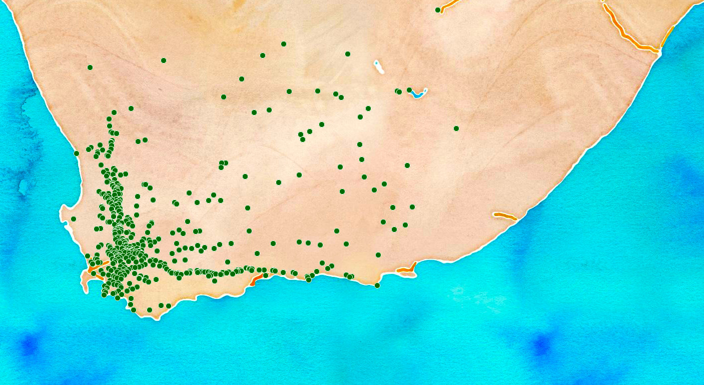
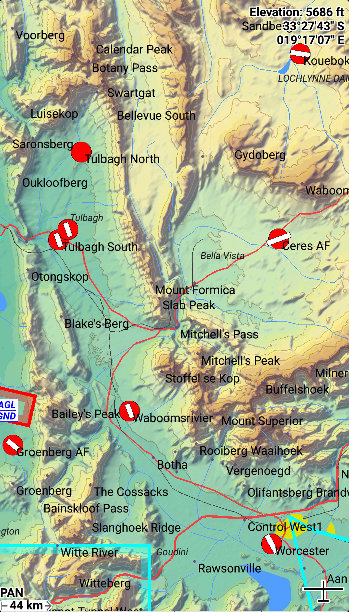

Waypoints (WP) for glider pilots flying in the Cape, South Africa.

A note on naming:
*Although pilots usually talk of* "turnpoints", *this project uses the more general term*
"waypoints" *to explicitly include Starting Points, Finishing Points, Reporting Points, 
Airfields, etc. and the actual Turn Points. This is defined in Sporting Code for Gliding (SC3).*

---
### Goals
1. [One](https://xkcd.com/927/), [single point of truth](https://en.wikipedia.org/wiki/Single_source_of_truth)
for waypoints, including unique names, unique three character shortcodes (trigraphs),
unique locations, and normalised descriptions.
2. Version controlled, with full history (who did what, when, and why).
3. Open source, open data, including all history and versions.
4. Anybody can contribute (and anybody can fork).
5. Automatically incorporated into XCSoar, Oudie, etc.

---
### :south_africa: To Fly with the waypoints :south_africa:
To use the WP file on your glide computer (that supports CUP files):

1. Download or copy the latest released [`ZA_Cape_yyyymmdd.cup`](../../releases/latest)
   CUP file (under "Assets") to the correct location on your device.
2. Activate it.
3. Fly.

### To View the WPs
1. [WaypointsZA](https://docs.google.com/spreadsheets/d/13YJ6NrfoLhxTgeO8fi1aIT0n_nm4z0_ixXWjndgwzjE/edit#gid=364570956) spreadsheet.
2. Live, generated [GeoJSON map](https://gist.github.com/csindle/736c3658c29ba2a29abffdc2917e1839).
3. Live, generated [searchable](https://gist.github.com/csindle/86d782cc0405dd54a80eecc3838ffe83) CSV file.
4. Generated [Google map](https://www.google.com/maps/d/u/0/edit?mid=1OdQ9Jp9IcUgXAMa7qQpaBRQReOhAuitc&usp=sharing) 
of latest *release*.

### To Contribute and Maintain the WPs
*We explicitly welcome contributions, comments, requests, and suggestions.*

Please see [`CONTRIBUTING`](CONTRIBUTING.md) for the details.

---
### Precedents
The BGA have been honing their WPs (and the management policies thereof) since 1988.
In lieu of our own policies and procedures, please use theirs for guidance:

1. [Policy](http://www.newportpeace.co.uk/turningpoints.htm)

Arizona gliding community WP documentation (who also use the modern git version control system):

1. [Instructions for updating and editing](https://docs.google.com/presentation/d/1pMjyXVpgSP-2waq6FuD5_nyMrU_6ApVSMYG6YpMSBvM/edit?usp=sharing)
1. [Map](https://www.google.com/maps/d/u/0/edit?mid=1kHawbgbNa_hPMl5rvOVMP27UdMX1PvQ_&ll=32.39213804431958%2C-111.49211784793266&z=11)
1. [Waypoint repository](https://github.com/DavisChappins/AZTurnpoints).

---
### Definitions
*(Up for debate: please make your voice heard!)*

In a WP **name** field, the following suffixes are defined:

1. **#** (hash): Air Activity, caution.  E.g. Para-gliding launch site (source BGA).
2. **911**: Emergency only. Landing area may be too narrow or otherwise unsuitable (source Arizona).
3. **U**: Unsurveyed.  A ground inspection has not been done; data from satellite only (source Arizona).

Multiple suffixes can be combined (space separated): e.g. "Buffelsport 911 U"

---
### Resources
1. [CUP file specification](https://downloads.naviter.com/docs/CUP-file-format-description.pdf)

---

